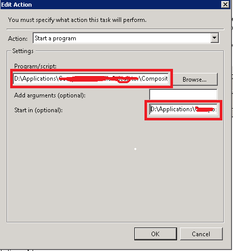

1. 计划任务与双击运行程序，效果不一样，双击能运行，但计划任务报错或不能运行；
   解决：可在计划任务（taskschd.msc）操作卡片设置 起始于选项，填入运行程序所在目录，不填默认c:\\ indows System32 中运行，不知道是这样的?

      

2. window 端口转发
   如端口43210转发到IP为192.168.0.192 端口9988 计算机上

   ````shell
   netsh interface portproxy add v4tov4 listenport=43210 connectaddress=192.168.0.192 connectport=9988
   ````


